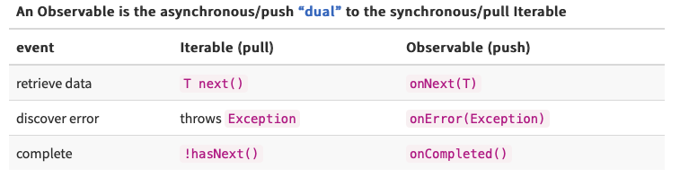

# What is ~~RxSwift~~ ~~Combine~~ Reactive Programming?

## What is Reactive Programming

There are a lot of articles about Reactive Programming and different implementations on the internet. However, most of them about practical usage and only few about what is this reactive programming and how does it actually work. For my personal opionion it is more important to understand how this frameworks work deep inside (spoiler: nothing complicated in there actually), rather than start to use an enumerous number of traits and operators meanwhile shoting in your leg.

So, what is Reactive programming?

According to Wikipedia:

```
Reactive programming is a declarative programming paradigm concerned with data streams and the propagation of change. With this paradigm it is possible to express static (e.g., arrays) or dynamic (e.g., event emitters) data streams with ease, and also communicate that an inferred dependency within the associated execution model exists, which facilitates the automatic propagation of the changed data flow.
```

Excuse me, WHAT?

  

Ok, let's start from the begining.

Reactive programming is an idea from the late 90s that inspired Erik Meijer, a computer scientist at Microsoft, to design and develop the Microsoft Rx library, but what is it exactly?

I don't want to make one defenition of what reactive programming is. I would go to the same complicated definition from wikipedia. Better to compare imperative and reactive approaches.

With an imperative approach developer can expect that the code instructions will execute incrimentally, one by one, one at a time, in order as you have writtem them.

With reactive approach you simply don't think about it. You think about how your system `react` on the new information. In simple words our system always ready to handle new information and technicaly doesn't even bother by order of calls in program.

It's important to understand that reactive aproach is not just a way to handle asyncronus code. However, while usign reactive paradign you will forget about threads, race conditions and everything. It's kinda not important anymore. To be trully open there's is still schedulers concept nearby, but it's not so complicated and won't be covered in this article.

I assume, that most of the readers of this arctile came from iOS development. So let me make an anology. Reactive programming is Notification center on steroids, but don't worry, a conterweight of the reactive frameworks that they are more sequential and understandable. In iOS development it's hard to do things in the one way. Because from the biginning Apple gave us several different approaches like: delegates, selectors, GCD and etc. Reactive paradigm could help solve on this problems in one fasion.

In this article I will use concepts of the main popular reactive framework for iOS: RxSwift (open source based) and Combine (iOS 13+ Apple developers based). Minimum iOS version for Combine is the one the most reasons, why we still considering third party frameworks like RxSwift for development.

## The tale of two friends

Right now I will suggest to stop a little bit of describing reactive definition. Let's put our attention on the action. 

Let me answer again on the question: What reactive programming is? Reactive programming is a friendship of two design patterns: `Iterator` and `Observer`. Let's make a quick reminder how does this patterns work.

`Iterator` is a behavioral design pattern that lets you traverse elements of a collection without exposing its underlying representation (list, stack, tree, etc.). You can read more by this [link](https://refactoring.guru/design-patterns/iterator).

`Observer` is a behavioral design pattern that lets you define a subscription mechanism to notify multiple objects about any events that happen to the object they’re observing. You can read more by this [link](https://refactoring.guru/design-patterns/observer).

How does this two fellas work together? In easy words, you use `Observer` pattern to be subscribed for new events and use `Iterator` pattern to treat streams of asynchronous events with the same sort of simple, composable operations that you use for collections of data items like arrays. It frees you from tangled webs of callbacks, and thereby makes your code more readable and less prone to bugs.


There are many terms used to describe this model of asynchronous programming and design. This document will use the following terms: An observer subscribes to an Observable. An Observable emits items or sends notifications to its observers by calling the observers’ methods.

In other documents and other contexts, what we are calling an “observer” is sometimes called a “subscriber,” “watcher,” or “reactor.” This model in general is often referred to as the “reactor pattern”.

Way to stop to think about threads and strart to think about sequences.


Syntaxis sugar helps to do hard things in the easy way.

Why Use Observables?  
The ReactiveX Observable model allows you to treat streams of asynchronous events with the same sort of simple, composable operations that you use for collections of data items like arrays. It frees you from tangled webs of callbacks, and thereby makes your code more readable and less prone to bugs.



How is this Observable implemented?

Who cares (actually we are, this article about this). However, who cares, while using it in your project.

- does it work synchronously on the same thread as the caller?
- does it work asynchronously on a distinct thread?
- does it divide its work over multiple threads that may return data to the caller in any order?
- does it use an Actor (or multiple Actors) instead of a thread pool?
- does it use NIO with an event-loop to do asynchronous network access?
- does it use an event-loop to separate the work thread from the callback thread?

The Observable type adds two missing semantics to the Gang of Four’s Observer pattern, to match those that are available in the Iterable type:

the ability for the producer to signal to the consumer that there is no more data available (a foreach loop on an Iterable completes and returns normally in such a case; an Observable calls its observer’s onCompleted method)
the ability for the producer to signal to the consumer that an error has occurred (an Iterable throws an exception if an error takes place during iteration; an Observable calls its observer’s onError method)
With these additions, ReactiveX harmonizes the Iterable and Observable types. The only difference between them is the direction in which the data flows. This is very important because now any operation you can perform on an Iterable, you can also perform on an Observable.


much more declarative way of doing things. you don't expect anything after your code was executed. You just react on changes in your system

Since we manipulate with collections, we could treat them as simple arrays.

https://github.com/ReactiveX/RxSwift/blob/master/Documentation/Why.md

https://github.com/ReactiveX/RxSwift/blob/master/Documentation/MathBehindRx.md

RX = OBSERVABLE + OBSERVER + SCHEDULERS
We are going to discuss these points in detail one by one.
Observable: Observable are nothing but the data streams. Observable packs the data that can be passed around from one thread to another thread. They basically emit the data periodically or only once in their life cycle based on their configurations. There are various operators that can help observer to emit some specific data based on certain events, but we will look into them in upcoming parts. For now, you can think observables as suppliers. They process and supply the data to other components.
Observers: Observers consumes the data stream emitted by the observable. Observers subscribe to the observable using subscribeOn() method to receive the data emitted by the observable. Whenever the observable emits the data all the registered observer receives the data in onNext() callback. Here they can perform various operations like parsing the JSON response or updating the UI. If there is an error thrown from observable, the observer will receive it in onError().
Schedulers: Remember that Rx is for asynchronous programming and we need a thread management. There is where schedules come into the picture. Schedulers are the component in Rx that tells observable and observers, on which thread they should run. You can use observeOn() method to tell observers, on which thread you should observe. Also, you can use scheduleOn() to tell the observable, on which thread you should run. There are main default threads are provided in RxJava like Schedulers.newThread() will create new background that. Schedulers.io() will execute the code on IO thread.

If you’re familiar with RxSwift you’ll notice that Publishers are basically Observables and Subscribers are Observers; they have different names but work the same way. A Publisher exposes values that can change and a Subscriber “subscribes” so it can receive all these changes.


ADD image that everything is sequence


People Are Afraid of usign reactive approaches like RxSwift.

## Where is it come from

Why do we need it?

Who in charge of creation?

Which variations could we use now

## How does it work?

picture of screaming guy down of the infinitive locs inside an rx

### Functional programming

## Lets make our own basic reactive framework


## Where to go after

- http://reactivex.io
- https://github.com/ReactiveX/RxSwift
- https://refactoring.guru/


# refubrished


It extends the observer pattern to support sequences of data and/or events and adds operators that allow you to compose sequences together declaratively while abstracting away concerns about things like low-level threading, synchronization, thread-safety, concurrent data structures, and non-blocking I/O.